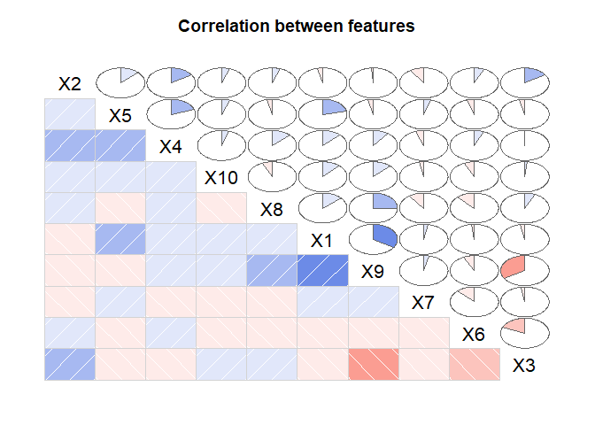

<!-- README.md is generated from README.Rmd. Please edit that file -->

# dl2

<!-- badges: start -->
<!-- badges: end -->

This package introduces a method for creating composite indicators by
leveraging the vector space defined by the observations and
incorporating a metric that reflects the proximity between units. This
quantitative approach enhances the comparability of units under study.
The proposed methodology mitigates the issue of linear dependence in the
model and seeks to identify functional relationships that optimize model
construction. Furthermore, this approach reduces researcher bias by
assigning weights through unsupervised machine learning techniques.
Monte Carlo simulations demonstrate the robustness of this methodology.

## Installation

You can install the development version of dl2 like so:

``` r
# install.packages("devtools")
devtools::install_github("E-Jimenez-Fernandez/dl2")
```

## Example

This is a basic example which shows you how to solve a common problem:

``` r
library(dl2)
## Basic example code
set.seed(123)
data <- data.frame(matrix(rnorm(500), ncol = 10))
result <- dl2(data, polarity = c(1,2), err = 0.001,iterations = 50, degrees = 2)
```



    #> [1] "Iteration 1"
    #> Model with pmethod="backward": GRSq 0.775 RSq 0.934 nterms 10
    #> CV fold 1  CVRSq  0.490   n.oof 40 20%   n.infold.nz 40 100%   n.oof.nz 10 100%
    #> CV fold 2  CVRSq  0.833   n.oof 40 20%   n.infold.nz 40 100%   n.oof.nz 10 100%
    #> CV fold 3  CVRSq  0.281   n.oof 40 20%   n.infold.nz 40 100%   n.oof.nz 10 100%
    #> CV fold 4  CVRSq  0.861   n.oof 40 20%   n.infold.nz 40 100%   n.oof.nz 10 100%
    #> CV fold 5  CVRSq  0.411   n.oof 40 20%   n.infold.nz 40 100%   n.oof.nz 10 100%
    #> CV all     CVRSq  0.575                  n.infold.nz 50 100%
    #> 
    #> [1] "Iteration 2"
    #> Model with pmethod="backward": GRSq 0.959 RSq 0.994 nterms 13
    #> CV fold 1  CVRSq  0.906   n.oof 40 20%   n.infold.nz 40 100%   n.oof.nz 10 100%
    #> CV fold 2  CVRSq  0.944   n.oof 40 20%   n.infold.nz 40 100%   n.oof.nz 10 100%
    #> CV fold 3  CVRSq  0.966   n.oof 40 20%   n.infold.nz 40 100%   n.oof.nz 10 100%
    #> CV fold 4  CVRSq  0.935   n.oof 40 20%   n.infold.nz 40 100%   n.oof.nz 10 100%
    #> CV fold 5  CVRSq  0.850   n.oof 40 20%   n.infold.nz 40 100%   n.oof.nz 10 100%
    #> CV all     CVRSq  0.920                  n.infold.nz 50 100%
    #> 
    #> [1] "Iteration 3"
    #> Model with pmethod="backward": GRSq 0.957 RSq 0.992 nterms 12
    #> CV fold 1  CVRSq  0.948   n.oof 40 20%   n.infold.nz 40 100%   n.oof.nz 10 100%
    #> CV fold 2  CVRSq  0.975   n.oof 40 20%   n.infold.nz 40 100%   n.oof.nz 10 100%
    #> CV fold 3  CVRSq  0.925   n.oof 40 20%   n.infold.nz 40 100%   n.oof.nz 10 100%
    #> CV fold 4  CVRSq  0.909   n.oof 40 20%   n.infold.nz 40 100%   n.oof.nz 10 100%
    #> CV fold 5  CVRSq  0.868   n.oof 40 20%   n.infold.nz 40 100%   n.oof.nz 10 100%
    #> CV all     CVRSq  0.925                  n.infold.nz 50 100%
    #> 
    #> [1] "Iteration 4"
    #> Model with pmethod="backward": GRSq 0.962 RSq 0.993 nterms 12
    #> CV fold 1  CVRSq  0.889   n.oof 40 20%   n.infold.nz 40 100%   n.oof.nz 10 100%
    #> CV fold 2  CVRSq  0.784   n.oof 40 20%   n.infold.nz 40 100%   n.oof.nz 10 100%
    #> CV fold 3  CVRSq  0.956   n.oof 40 20%   n.infold.nz 40 100%   n.oof.nz 10 100%
    #> CV fold 4  CVRSq  0.963   n.oof 40 20%   n.infold.nz 40 100%   n.oof.nz 10 100%
    #> CV fold 5  CVRSq  0.873   n.oof 40 20%   n.infold.nz 40 100%   n.oof.nz 10 100%
    #> CV all     CVRSq  0.893                  n.infold.nz 50 100%
    #> 
    #> [1] "Iteration 5"
    #> Model with pmethod="backward": GRSq 0.961 RSq 0.994 nterms 13
    #> CV fold 1  CVRSq  0.973   n.oof 40 20%   n.infold.nz 40 100%   n.oof.nz 10 100%
    #> CV fold 2  CVRSq  0.966   n.oof 40 20%   n.infold.nz 40 100%   n.oof.nz 10 100%
    #> CV fold 3  CVRSq  0.916   n.oof 40 20%   n.infold.nz 40 100%   n.oof.nz 10 100%
    #> CV fold 4  CVRSq  0.931   n.oof 40 20%   n.infold.nz 40 100%   n.oof.nz 10 100%
    #> CV fold 5  CVRSq  0.977   n.oof 40 20%   n.infold.nz 40 100%   n.oof.nz 10 100%
    #> CV all     CVRSq  0.952                  n.infold.nz 50 100%
    #> 
    #> [1] "Iteration 6"
    #> Model with pmethod="backward": GRSq 0.962 RSq 0.993 nterms 12
    #> CV fold 1  CVRSq  0.968   n.oof 40 20%   n.infold.nz 40 100%   n.oof.nz 10 100%
    #> CV fold 2  CVRSq  0.951   n.oof 40 20%   n.infold.nz 40 100%   n.oof.nz 10 100%
    #> CV fold 3  CVRSq  0.909   n.oof 40 20%   n.infold.nz 40 100%   n.oof.nz 10 100%
    #> CV fold 4  CVRSq  0.955   n.oof 40 20%   n.infold.nz 40 100%   n.oof.nz 10 100%
    #> CV fold 5  CVRSq  0.920   n.oof 40 20%   n.infold.nz 40 100%   n.oof.nz 10 100%
    #> CV all     CVRSq  0.941                  n.infold.nz 50 100%
    #> 
    #> [1] "Iteration 7"
    #> Model with pmethod="backward": GRSq 0.954 RSq 0.993 nterms 13
    #> CV fold 1  CVRSq  0.936   n.oof 40 20%   n.infold.nz 40 100%   n.oof.nz 10 100%
    #> CV fold 2  CVRSq  0.960   n.oof 40 20%   n.infold.nz 40 100%   n.oof.nz 10 100%
    #> CV fold 3  CVRSq  0.805   n.oof 40 20%   n.infold.nz 40 100%   n.oof.nz 10 100%
    #> CV fold 4  CVRSq  0.969   n.oof 40 20%   n.infold.nz 40 100%   n.oof.nz 10 100%
    #> CV fold 5  CVRSq  0.889   n.oof 40 20%   n.infold.nz 40 100%   n.oof.nz 10 100%
    #> CV all     CVRSq  0.912                  n.infold.nz 50 100%
    #> 
    #> [1] "Iteration 8"
    #> Model with pmethod="backward": GRSq 0.963 RSq 0.994 nterms 13
    #> CV fold 1  CVRSq  0.941   n.oof 40 20%   n.infold.nz 40 100%   n.oof.nz 10 100%
    #> CV fold 2  CVRSq  0.985   n.oof 40 20%   n.infold.nz 40 100%   n.oof.nz 10 100%
    #> CV fold 3  CVRSq  0.819   n.oof 40 20%   n.infold.nz 40 100%   n.oof.nz 10 100%
    #> CV fold 4  CVRSq  0.942   n.oof 40 20%   n.infold.nz 40 100%   n.oof.nz 10 100%
    #> CV fold 5  CVRSq  0.902   n.oof 40 20%   n.infold.nz 40 100%   n.oof.nz 10 100%
    #> CV all     CVRSq  0.918                  n.infold.nz 50 100%
    #> 
    #> [1] "Iteration 9"
    #> Model with pmethod="backward": GRSq 0.963 RSq 0.989 nterms 10
    #> CV fold 1  CVRSq  0.934   n.oof 40 20%   n.infold.nz 40 100%   n.oof.nz 10 100%
    #> CV fold 2  CVRSq  0.908   n.oof 40 20%   n.infold.nz 40 100%   n.oof.nz 10 100%
    #> CV fold 3  CVRSq  0.944   n.oof 40 20%   n.infold.nz 40 100%   n.oof.nz 10 100%
    #> CV fold 4  CVRSq  0.964   n.oof 40 20%   n.infold.nz 40 100%   n.oof.nz 10 100%
    #> CV fold 5  CVRSq  0.955   n.oof 40 20%   n.infold.nz 40 100%   n.oof.nz 10 100%
    #> CV all     CVRSq  0.941                  n.infold.nz 50 100%
    #> 
    #> [1] "Iteration 10"
    #> Model with pmethod="backward": GRSq 0.958 RSq 0.992 nterms 12
    #> CV fold 1  CVRSq  0.931   n.oof 40 20%   n.infold.nz 40 100%   n.oof.nz 10 100%
    #> CV fold 2  CVRSq  0.884   n.oof 40 20%   n.infold.nz 40 100%   n.oof.nz 10 100%
    #> CV fold 3  CVRSq  0.939   n.oof 40 20%   n.infold.nz 40 100%   n.oof.nz 10 100%
    #> CV fold 4  CVRSq  0.965   n.oof 40 20%   n.infold.nz 40 100%   n.oof.nz 10 100%
    #> CV fold 5  CVRSq  0.961   n.oof 40 20%   n.infold.nz 40 100%   n.oof.nz 10 100%
    #> CV all     CVRSq  0.936                  n.infold.nz 50 100%
    #> 
    #> [1] "Iteration 11"
    #> Model with pmethod="backward": GRSq 0.958 RSq 0.992 nterms 12
    #> CV fold 1  CVRSq  0.981   n.oof 40 20%   n.infold.nz 40 100%   n.oof.nz 10 100%
    #> CV fold 2  CVRSq  0.964   n.oof 40 20%   n.infold.nz 40 100%   n.oof.nz 10 100%
    #> CV fold 3  CVRSq  0.972   n.oof 40 20%   n.infold.nz 40 100%   n.oof.nz 10 100%
    #> CV fold 4  CVRSq  0.937   n.oof 40 20%   n.infold.nz 40 100%   n.oof.nz 10 100%
    #> CV fold 5  CVRSq  0.912   n.oof 40 20%   n.infold.nz 40 100%   n.oof.nz 10 100%
    #> CV all     CVRSq  0.953                  n.infold.nz 50 100%

    # The normalized data matrix after adjusting for variable polarity. Each variable # is scaled between 0 and 1 depending on its polarity (positive or negative).

    print(result$normat)
    #>            X1        X2         X3        X4         X5         X6         X7
    #> 1  0.34001128 0.5698846 0.67668541 0.5389689 0.00000000 0.65899784 0.67309363
    #> 2  0.41987885 0.5071992 0.44379176 0.5430764 0.24908241 0.70499576 0.68224978
    #> 3  0.85243940 0.5040137 0.56503722 0.6390463 0.69238466 0.65117346 0.72769207
    #> 4  0.49258603 0.8179183 0.58931896 0.9335599 0.46523704 0.54390035 0.75556010
    #> 5  0.50679914 0.4633375 0.73476181 0.7382710 0.73430923 0.17151549 0.60509938
    #> 6  0.89024714 0.8508035 0.51648271 0.7736287 0.75170541 0.58811743 0.41723218
    #> 7  0.58698838 0.1691128 0.69462220 0.5883444 0.83947910 0.29935736 0.99070557
    #> 8  0.16963935 0.6435631 0.90723038 0.7938499 0.78496812 0.41049048 0.44637757
    #> 9  0.30945271 0.5410924 0.59718824 0.4973957 0.15396364 0.59430934 0.19582855
    #> 10 0.36777374 0.5615722 0.28437540 0.7943205 0.63305967 0.94477849 0.00000000
    #> 11 0.77152522 0.5979778 0.64416722 0.4807567 0.58436893 0.69493082 0.18005736
    #> 12 0.56254137 0.4018336 0.35926238 0.9425234 0.54940001 0.68721480 0.31316941
    #> 13 0.57244511 0.4394442 0.89517766 0.9888735 0.27154516 0.55460317 0.92041355
    #> 14 0.50230036 0.2870217 0.51901903 0.0000000 0.76289418 0.24517946 0.64528406
    #> 15 0.34113193 0.2751867 0.38058420 0.8036083 0.89677730 0.00000000 0.58428831
    #> 16 0.90762034 0.5810511 0.43313299 0.6465103 0.14699767 0.18409145 0.32618983
    #> 17 0.59591925 0.6132275 0.48019786 0.5721795 0.74184671 0.59912735 0.52404690
    #> 18 0.00000000 0.5253357 0.65990366 0.8183107 0.82106289 1.00000000 0.80596244
    #> 19 0.64512777 0.7186556 0.71022401 0.5984782 0.96527685 0.66225173 0.08634617
    #> 20 0.36121372 0.9694766 0.75222004 0.6309700 0.97888948 0.54421876 0.27536398
    #> 21 0.21733226 0.4043449 0.47731576 0.7593455 0.77916710 0.35758191 0.44015481
    #> 22 0.42282948 0.0000000 0.73376408 0.6976840 0.44422016 0.32856305 0.20036824
    #> 23 0.22744434 0.7372192 0.62375252 0.7195126 0.30600421 0.39726566 0.82555404
    #> 24 0.29928764 0.3558251 0.56730053 0.2444259 0.41904137 0.91079305 0.33663132
    #> 25 0.32439951 0.3605381 0.06169635 0.8748934 0.72006713 0.35643858 0.62606689
    #> 26 0.06768683 0.7416299 0.66261085 0.9528092 0.60108743 0.67651913 0.33102586
    #> 27 0.67811743 0.4502157 0.44896760 0.7037265 0.81587286 0.52308202 0.51308074
    #> 28 0.51262309 0.2420662 0.48687086 0.6438184 0.81941962 0.54783789 0.34344330
    #> 29 0.20033021 0.5538689 0.73722682 0.6161279 0.36928595 0.46051691 0.17166046
    #> 30 0.77871482 0.4826591 0.52281021 0.8127272 0.90326443 0.56015419 0.49642660
    #> 31 0.57865774 0.5148298 0.15783816 0.9456318 0.06842941 0.97800964 0.24940490
    #> 32 0.40418719 0.5992323 0.39693318 0.4345175 0.64325777 0.38437884 0.78879421
    #> 33 0.69198216 0.4311149 0.49571381 0.7888434 0.55759092 0.47092291 0.67464927
    #> 34 0.68787338 0.6568540 0.60736563 0.9021740 0.82540772 0.63184674 0.12674378
    #> 35 0.67419875 0.4645127 1.00000000 0.7639369 0.77928378 0.53707305 0.40593362
    #> 36 0.64205307 0.5873345 0.23325034 0.7553461 0.98796607 0.53314820 1.00000000
    #> 37 0.60947654 0.7574795 0.85731848 0.4681885 0.66928049 0.51166936 0.83173116
    #> 38 0.46056626 0.6103301 0.32748490 0.6934123 0.50014118 0.16106079 0.54730226
    #> 39 0.40155365 0.4410623 0.04598820 0.5463692 0.52674622 0.62033914 0.28651658
    #> 40 0.38353720 0.7690370 0.85328635 0.8217184 0.83749342 0.52474572 0.52312067
    #> 41 0.30755355 0.7344982 0.33667342 0.6649165 0.83948448 0.27772949 0.34558845
    #> 42 0.42526146 0.6355087 0.56877049 0.7833590 0.75899801 0.30593046 0.26372181
    #> 43 0.16955831 0.5666406 0.88416523 0.6912491 0.19747642 0.28343887 0.08961795
    #> 44 1.00000000 0.3739046 0.87032666 0.9087318 0.93746589 0.70884593 0.48451240
    #> 45 0.76762738 0.8161503 0.89124192 1.0000000 0.66819194 0.07175913 0.51091925
    #> 46 0.20396413 0.3800531 0.63346734 0.2732579 0.08330362 0.54977642 0.92689479
    #> 47 0.37811744 1.0000000 0.85758707 0.5800578 0.64625196 0.10525150 0.47392242
    #> 48 0.36269744 0.8543930 0.34001230 0.9869217 1.00000000 0.89983602 0.63803269
    #> 49 0.66413583 0.4611292 0.00000000 0.8462961 0.80468125 0.56106574 0.73636509
    #> 50 0.45537778 0.2852769 0.81551865 0.9724680 0.48146063 0.25759649 0.54219814
    #>            X8        X9        X10
    #> 1  0.30899441 0.4902210 0.11755318
    #> 2  0.90607182 0.7074759 0.20032824
    #> 3  0.59529984 0.6015553 0.33218649
    #> 4  0.48732325 0.4813501 0.27181789
    #> 5  0.68779445 0.3425695 0.22824981
    #> 6  0.44419236 0.8030786 1.00000000
    #> 7  0.42880195 0.5450157 0.18660012
    #> 8  0.51703595 0.3255655 0.53067844
    #> 9  1.00000000 0.5825221 0.37633166
    #> 10 0.00000000 0.4305360 0.48973456
    #> 11 0.55123307 0.3779755 0.23800102
    #> 12 0.38120489 0.4224927 0.50123386
    #> 13 0.45613046 0.3460291 0.31423811
    #> 14 0.30706283 0.4999723 0.51033856
    #> 15 0.34815855 0.5576971 0.66177309
    #> 16 0.55212519 1.0000000 0.16508889
    #> 17 0.43540505 0.4940667 0.26627006
    #> 18 0.69815728 0.3902645 0.05417133
    #> 19 0.34036408 0.3694110 0.41201990
    #> 20 0.60200158 0.5857894 0.18342399
    #> 21 0.03070753 0.1225944 0.00000000
    #> 22 0.83823870 0.4188048 0.48678489
    #> 23 0.60258699 0.4505686 0.71141652
    #> 24 0.34662592 0.2232245 0.47769787
    #> 25 0.40920782 0.6181641 0.47223875
    #> 26 0.62749962 0.5649705 0.39335722
    #> 27 0.70835546 0.0000000 0.05675036
    #> 28 0.48179685 0.4734203 0.49641787
    #> 29 0.51331798 0.1515462 0.34562042
    #> 30 0.86587867 0.7610122 0.47518134
    #> 31 0.50361875 0.5134247 0.42166182
    #> 32 0.47271379 0.4005531 0.35833453
    #> 33 0.47579158 0.4161039 0.13959375
    #> 34 0.71991635 0.6751355 0.39990595
    #> 35 0.41595725 0.4718074 0.27232175
    #> 36 0.23680834 0.6893767 0.25808257
    #> 37 0.41990711 0.3342357 0.22876781
    #> 38 0.73591113 0.2604208 0.54996238
    #> 39 0.59696067 0.9170414 0.07517518
    #> 40 0.44177032 0.2304802 0.50824030
    #> 41 0.63892716 0.7218379 0.44888908
    #> 42 0.93880682 0.3854070 0.12323698
    #> 43 0.33493905 0.3447108 0.14695533
    #> 44 0.67514298 0.5152842 0.66117017
    #> 45 0.62433908 0.6036118 0.61438309
    #> 46 0.21192814 0.4428304 0.71899317
    #> 47 0.66415851 0.3885714 0.38685065
    #> 48 0.34258577 0.3003907 0.39051870
    #> 49 0.76074448 0.8827894 0.34753787
    #> 50 0.58086035 0.8002679 0.30697938

    # A vector of weights for each variable, calculated using the MARS model. These # # weights are used to combine the variables into a composite indicator.

    print(result$Weights)
    #>  [1] 1.000000000 0.695240286 0.006175856 0.485181687 0.165320800 0.006175856
    #>  [7] 0.322046124 0.239020341 0.061758562 0.006175856

    # A numeric vector that tracks the error values for each iteration of the #algorithm. The error is calculated as the difference between the composite indicator at each step and the target value.

    print(result$derror)
    #>  [1] 1.981125e+01 3.834825e-01 7.567244e-02 6.123723e-02 1.999865e-03
    #>  [6] 1.162395e-02 2.234908e-02 1.259355e-02 2.410095e-02 1.126442e-03
    #> [11] 2.321011e-04

    # The initial Frechet index or composite indicator assuming all weights equal to one, which is a distance-based measure used to assess the proximity between the variables before any weights are applied.

    print(result$frechet)
    #>       Frechet.Index
    #>  [1,]      1.557470
    #>  [2,]      1.819774
    #>  [3,]      1.991956
    #>  [4,]      1.938214
    #>  [5,]      1.770235
    #>  [6,]      2.304112
    #>  [7,]      1.869057
    #>  [8,]      1.880182
    #>  [9,]      1.699645
    #> [10,]      1.697353
    #> [11,]      1.720207
    #> [12,]      1.715394
    #> [13,]      1.988728
    #> [14,]      1.505751
    #> [15,]      1.731622
    #> [16,]      1.805815
    #> [17,]      1.725584
    #> [18,]      2.085058
    #> [19,]      1.896079
    #> [20,]      2.025769
    #> [21,]      1.399942
    #> [22,]      1.632296
    #> [23,]      1.872758
    #> [24,]      1.454095
    #> [25,]      1.677665
    #> [26,]      1.922949
    #> [27,]      1.751241
    #> [28,]      1.662870
    #> [29,]      1.433126
    #> [30,]      2.168869
    #> [31,]      1.799292
    #> [32,]      1.601511
    #> [33,]      1.714509
    #> [34,]      2.077990
    #> [35,]      1.945305
    #> [36,]      2.059222
    #> [37,]      1.908225
    #> [38,]      1.630998
    #> [39,]      1.613619
    #> [40,]      1.974547
    #> [41,]      1.794887
    #> [42,]      1.818289
    #> [43,]      1.410453
    #> [44,]      2.344697
    #> [45,]      2.212227
    #> [46,]      1.608814
    #> [47,]      1.899991
    #> [48,]      2.127923
    #> [49,]      2.086458
    #> [50,]      1.887782

    # A correlation plot (produced by the `corrgram` package) that visualizes the relationships between the normalized variables.

    print(result$corrgr)
    #>              X2          X5           X4         X10          X8          X1
    #> X2   1.00000000  0.12841778  0.156263706  0.05458865  0.05321692 -0.03586983
    #> X5   0.12841778  1.00000000  0.198093836  0.05354474 -0.03354643  0.21417598
    #> X4   0.15626371  0.19809384  1.000000000  0.05007031  0.13100883  0.12239437
    #> X10  0.05458865  0.05354474  0.050070315  1.00000000 -0.06433586  0.11562502
    #> X8   0.05321692 -0.03354643  0.131008828 -0.06433586  1.00000000  0.13489220
    #> X1  -0.03586983  0.21417598  0.122394367  0.11562502  0.13489220  1.00000000
    #> X9  -0.01042877 -0.03312414  0.104926072  0.12302613  0.25096439  0.34208310
    #> X7  -0.09089400  0.04546078 -0.052754901 -0.02827734 -0.09984849  0.03060782
    #> X6   0.06219321 -0.05125091  0.061917491 -0.06851288 -0.12426231 -0.01716844
    #> X3   0.15607113 -0.03862479 -0.007740304  0.01572214  0.06999370 -0.02910612
    #>              X9          X7          X6           X3
    #> X2  -0.01042877 -0.09089400  0.06219321  0.156071133
    #> X5  -0.03312414  0.04546078 -0.05125091 -0.038624792
    #> X4   0.10492607 -0.05275490  0.06191749 -0.007740304
    #> X10  0.12302613 -0.02827734 -0.06851288  0.015722142
    #> X8   0.25096439 -0.09984849 -0.12426231  0.069993701
    #> X1   0.34208310  0.03060782 -0.01716844 -0.029106120
    #> X9   1.00000000  0.03440539 -0.07188709 -0.341466262
    #> X7   0.03440539  1.00000000 -0.12440454 -0.027731356
    #> X6  -0.07188709 -0.12440454  1.00000000 -0.186482921
    #> X3  -0.34146626 -0.02773136 -0.18648292  1.000000000

    # The final composite indicator after the iterative process. This is the weighted sum of the variables, which reflects the importance of each based on the calculated weights.

    print(result$Comp.Indicator)
    #>    p2distance.1
    #> 1     0.8194521
    #> 2     0.9434383
    #> 3     1.2097592
    #> 4     1.1940407
    #> 5     1.0008800
    #> 6     1.3537400
    #> 7     1.0153912
    #> 8     0.9310362
    #> 9     0.8371701
    #> 10    0.8636141
    #> 11    1.0536766
    #> 12    0.9961089
    #> 13    1.1340171
    #> 14    0.7625705
    #> 15    0.8814879
    #> 16    1.1980369
    #> 17    1.0096028
    #> 18    0.9860027
    #> 19    1.0716663
    #> 20    1.1283897
    #> 21    0.7789536
    #> 22    0.8029566
    #> 23    1.0107253
    #> 24    0.5589498
    #> 25    0.9190980
    #> 26    1.0211693
    #> 27    1.0764541
    #> 28    0.8531031
    #> 29    0.7344598
    #> 30    1.2341289
    #> 31    1.0285161
    #> 32    0.9161874
    #> 33    1.0843253
    #> 34    1.2014996
    #> 35    1.0510430
    #> 36    1.2072910
    #> 37    1.1086413
    #> 38    0.9892061
    #> 39    0.8081938
    #> 40    1.0713024
    #> 41    0.9855521
    #> 42    1.0485746
    #> 43    0.7296950
    #> 44    1.3618291
    #> 45    1.3484632
    #> 46    0.6974684
    #> 47    1.1238909
    #> 48    1.2034712
    #> 49    1.1862662
    #> 50    0.9904929

    # The composite indicator from the previous iteration, used to compare and update the indicator in subsequent iterations.

    print(result$Comp.Indicator_1)
    #>    p2distance.1
    #> 1     0.8201508
    #> 2     0.9456756
    #> 3     1.2117347
    #> 4     1.1946120
    #> 5     1.0027666
    #> 6     1.3561736
    #> 7     1.0179486
    #> 8     0.9331669
    #> 9     0.8394417
    #> 10    0.8652547
    #> 11    1.0552107
    #> 12    0.9971041
    #> 13    1.1340772
    #> 14    0.7657490
    #> 15    0.8846560
    #> 16    1.2003261
    #> 17    1.0117302
    #> 18    0.9884501
    #> 19    1.0744480
    #> 20    1.1316020
    #> 21    0.7806454
    #> 22    0.8049196
    #> 23    1.0114501
    #> 24    0.5607549
    #> 25    0.9213359
    #> 26    1.0228368
    #> 27    1.0782873
    #> 28    0.8561228
    #> 29    0.7352245
    #> 30    1.2375236
    #> 31    1.0290586
    #> 32    0.9178405
    #> 33    1.0853065
    #> 34    1.2041494
    #> 35    1.0532481
    #> 36    1.2101159
    #> 37    1.1099920
    #> 38    0.9901935
    #> 39    0.8121986
    #> 40    1.0730766
    #> 41    0.9889856
    #> 42    1.0508500
    #> 43    0.7301674
    #> 44    1.3643117
    #> 45    1.3499124
    #> 46    0.6983364
    #> 47    1.1253571
    #> 48    1.2054820
    #> 49    1.1895457
    #> 50    0.9926833

    # The number of iterations the algorithm has performed before stopping, either due to reaching the error threshold or hitting the maximum number of iterations.

    print(result$iteration)
    #> [1] 11

    # The initial distance matrix, which contains the squared differences between the variables, raised to the specified power (`degrees`).

    print(result$dist.in)
    #>             X1         X2          X3         X4          X5          X6
    #> 1  0.115607670 0.32476851 0.457903140 0.29048750 0.000000000 0.434278152
    #> 2  0.176298245 0.25725102 0.196951124 0.29493198 0.062042046 0.497019028
    #> 3  0.726652931 0.25402978 0.319267060 0.40838015 0.479396520 0.424026880
    #> 4  0.242640997 0.66899034 0.347296838 0.87153404 0.216445505 0.295827592
    #> 5  0.256845366 0.21468163 0.539874923 0.54504407 0.539210038 0.029417562
    #> 6  0.792539970 0.72386658 0.266754394 0.59850139 0.565061021 0.345882110
    #> 7  0.344555357 0.02859914 0.482500006 0.34614912 0.704725161 0.089614830
    #> 8  0.028777508 0.41417345 0.823066957 0.63019759 0.616174945 0.168502433
    #> 9  0.095760979 0.29278102 0.356633795 0.24740252 0.023704803 0.353203586
    #> 10 0.135257522 0.31536334 0.080869370 0.63094499 0.400764550 0.892606389
    #> 11 0.595251162 0.35757747 0.414951411 0.23112704 0.341487048 0.482928850
    #> 12 0.316452797 0.16147022 0.129069457 0.88835030 0.301840370 0.472264180
    #> 13 0.327693403 0.19311117 0.801343042 0.97787070 0.073736774 0.307584679
    #> 14 0.252305653 0.08238144 0.269380758 0.00000000 0.582007531 0.060112967
    #> 15 0.116370991 0.07572774 0.144844334 0.64578628 0.804209534 0.000000000
    #> 16 0.823774686 0.33762042 0.187604188 0.41797555 0.021608315 0.033889663
    #> 17 0.355119753 0.37604798 0.230589986 0.32738935 0.550336537 0.358953583
    #> 18 0.000000000 0.27597763 0.435472846 0.66963240 0.674144270 1.000000000
    #> 19 0.416189837 0.51646590 0.504418151 0.35817616 0.931759391 0.438577358
    #> 20 0.130475351 0.93988497 0.565834986 0.39812314 0.958224610 0.296174057
    #> 21 0.047233311 0.16349482 0.227830333 0.57660562 0.607101373 0.127864820
    #> 22 0.178784771 0.00000000 0.538409722 0.48676294 0.197331548 0.107953675
    #> 23 0.051730929 0.54349211 0.389067210 0.51769835 0.093638578 0.157820004
    #> 24 0.089573093 0.12661148 0.321829886 0.05974403 0.175595666 0.829543974
    #> 25 0.105235041 0.12998772 0.003806440 0.76543845 0.518496670 0.127048459
    #> 26 0.004581507 0.55001491 0.439053134 0.90784528 0.361306097 0.457678137
    #> 27 0.459843244 0.20269420 0.201571910 0.49523101 0.665648524 0.273614798
    #> 28 0.262782433 0.05859605 0.237043235 0.41450210 0.671448522 0.300126350
    #> 29 0.040132192 0.30677071 0.543503391 0.37961357 0.136372116 0.212075824
    #> 30 0.606396770 0.23295980 0.273330521 0.66052546 0.815886637 0.313772721
    #> 31 0.334844775 0.26504970 0.024912884 0.89421951 0.004682584 0.956502858
    #> 32 0.163367283 0.35907938 0.157555953 0.18880545 0.413780560 0.147747095
    #> 33 0.478839308 0.18586004 0.245732184 0.62227399 0.310907637 0.221768385
    #> 34 0.473169781 0.43145723 0.368893006 0.81391784 0.681297905 0.399230308
    #> 35 0.454543957 0.21577207 1.000000000 0.58359953 0.607283207 0.288447466
    #> 36 0.412232142 0.34496186 0.054405720 0.57054777 0.976076948 0.284246998
    #> 37 0.371461657 0.57377516 0.734994984 0.21920043 0.447936381 0.261805535
    #> 38 0.212121280 0.37250281 0.107246360 0.48082055 0.250141202 0.025940579
    #> 39 0.161245336 0.19453592 0.002114914 0.29851934 0.277461585 0.384820655
    #> 40 0.147100787 0.59141797 0.728097588 0.67522115 0.701395226 0.275358065
    #> 41 0.094589184 0.53948767 0.113348989 0.44211399 0.704734188 0.077133668
    #> 42 0.180847312 0.40387125 0.323499873 0.61365128 0.576077979 0.093593448
    #> 43 0.028750022 0.32108159 0.781748151 0.47782535 0.038996937 0.080337594
    #> 44 1.000000000 0.13980466 0.757468494 0.82579357 0.878842291 0.502462546
    #> 45 0.589251792 0.66610130 0.794312157 1.00000000 0.446480466 0.005149373
    #> 46 0.041601366 0.14444033 0.401280866 0.07466987 0.006939494 0.302254115
    #> 47 0.142972798 1.00000000 0.735455576 0.33646704 0.417641602 0.011077877
    #> 48 0.131549436 0.72998732 0.115608362 0.97401452 1.000000000 0.809704855
    #> 49 0.441076397 0.21264018 0.000000000 0.71621715 0.647511917 0.314794763
    #> 50 0.207368919 0.08138289 0.665070671 0.94569395 0.231804336 0.066355954
    #>             X7           X8         X9         X10
    #> 1  0.453055037 0.0954775482 0.24031659 0.013818749
    #> 2  0.465464760 0.8209661458 0.50052211 0.040131404
    #> 3  0.529535747 0.3543819019 0.36186884 0.110347861
    #> 4  0.570871061 0.2374839499 0.23169792 0.073884964
    #> 5  0.366145266 0.4730612008 0.11735389 0.052097975
    #> 6  0.174082691 0.1973068532 0.64493520 1.000000000
    #> 7  0.981497530 0.1838711130 0.29704207 0.034819606
    #> 8  0.199252937 0.2673261704 0.10599291 0.281619604
    #> 9  0.038348820 1.0000000000 0.33933198 0.141625518
    #> 10 0.000000000 0.0000000000 0.18536128 0.239839943
    #> 11 0.032420653 0.3038578982 0.14286549 0.056644487
    #> 12 0.098075078 0.1453171674 0.17850011 0.251235378
    #> 13 0.847161099 0.2080549948 0.11973614 0.098745588
    #> 14 0.416391524 0.0942875837 0.24997231 0.260445448
    #> 15 0.341392827 0.1212143788 0.31102610 0.437943620
    #> 16 0.106399802 0.3048422235 1.00000000 0.027254343
    #> 17 0.274625153 0.1895775549 0.24410194 0.070899747
    #> 18 0.649575457 0.4874235811 0.15230638 0.002934533
    #> 19 0.007455662 0.1158477041 0.13646449 0.169760401
    #> 20 0.075825320 0.3624059045 0.34314921 0.033644359
    #> 21 0.193736256 0.0009429527 0.01502939 0.000000000
    #> 22 0.040147433 0.7026441222 0.17539746 0.236959531
    #> 23 0.681539474 0.3631110792 0.20301204 0.506113459
    #> 24 0.113320648 0.1201495295 0.04982917 0.228195254
    #> 25 0.391959753 0.1674510388 0.38212682 0.223009440
    #> 26 0.109578117 0.3937557720 0.31919166 0.154729904
    #> 27 0.263251842 0.5017674636 0.00000000 0.003220604
    #> 28 0.117953297 0.2321282093 0.22412683 0.246430702
    #> 29 0.029467313 0.2634953442 0.02296625 0.119453472
    #> 30 0.246439366 0.7497458627 0.57913955 0.225797303
    #> 31 0.062202805 0.2536318405 0.26360492 0.177798691
    #> 32 0.622196301 0.2234583316 0.16044279 0.128403637
    #> 33 0.455151640 0.2263776308 0.17314246 0.019486416
    #> 34 0.016063986 0.5182795507 0.45580788 0.159924766
    #> 35 0.164782106 0.1730204301 0.22260225 0.074159136
    #> 36 1.000000000 0.0560781914 0.47524022 0.066606613
    #> 37 0.691776723 0.1763219810 0.11171353 0.052334712
    #> 38 0.299539759 0.5415651971 0.06781899 0.302458621
    #> 39 0.082091752 0.3563620415 0.84096492 0.005651308
    #> 40 0.273655238 0.1951610164 0.05312114 0.258308207
    #> 41 0.119431376 0.4082279151 0.52104990 0.201501405
    #> 42 0.069549195 0.8813582432 0.14853858 0.015187354
    #> 43 0.008031376 0.1121841644 0.11882555 0.021595869
    #> 44 0.234752266 0.4558180400 0.26551781 0.437145992
    #> 45 0.261038478 0.3897992853 0.36434719 0.377466587
    #> 46 0.859133950 0.0449135346 0.19609875 0.516951175
    #> 47 0.224602462 0.4411065250 0.15098777 0.149653426
    #> 48 0.407085713 0.1173650105 0.09023456 0.152504854
    #> 49 0.542233540 0.5787321625 0.77931711 0.120782570
    #> 50 0.293978826 0.3373987422 0.64042878 0.094236339

    # The final distance matrix after applying the calculated weights to the variables. This represents the final distance-based composite indicator.

    print(result$dist.fin)
    #>             X1         X2           X3         X4           X5           X6
    #> 1  0.115607670 0.22579215 2.827944e-03 0.14093921 0.0000000000 2.682039e-03
    #> 2  0.176298245 0.17885127 1.216342e-03 0.14309560 0.0102568406 3.069518e-03
    #> 3  0.726652931 0.17661174 1.971747e-03 0.19813857 0.0792542160 2.618729e-03
    #> 4  0.242640997 0.46510904 2.144855e-03 0.42285235 0.0357829440 1.826989e-03
    #> 5  0.256845366 0.14925532 3.334190e-03 0.26444540 0.0891426347 1.816786e-04
    #> 6  0.792539970 0.50326121 1.647437e-03 0.29038191 0.0934163399 2.136118e-03
    #> 7  0.344555357 0.01988328 2.979851e-03 0.16794522 0.1165057272 5.534483e-04
    #> 8  0.028777508 0.28795007 5.083143e-03 0.30576033 0.1018665346 1.040647e-03
    #> 9  0.095760979 0.20355316 2.202519e-03 0.12003517 0.0039188971 2.181335e-03
    #> 10 0.135257522 0.21925330 4.994376e-04 0.30612295 0.0662547160 5.512609e-03
    #> 11 0.595251162 0.24860226 2.562680e-03 0.11213861 0.0564549118 2.982499e-03
    #> 12 0.316452797 0.11226060 7.971144e-04 0.43101129 0.0499004913 2.916636e-03
    #> 13 0.327693403 0.13425867 4.948979e-03 0.47444496 0.0121902225 1.899599e-03
    #> 14 0.252305653 0.05727490 1.663657e-03 0.00000000 0.0962179505 3.712490e-04
    #> 15 0.116370991 0.05264897 8.945378e-04 0.31332368 0.1329525633 0.000000e+00
    #> 16 0.823774686 0.23472732 1.158616e-03 0.20279408 0.0035723040 2.092977e-04
    #> 17 0.355119753 0.26144371 1.424091e-03 0.15884332 0.0909820764 2.216846e-03
    #> 18 0.000000000 0.19187077 2.689418e-03 0.32489338 0.1114500698 6.175856e-03
    #> 19 0.416189837 0.35906790 3.115214e-03 0.17378051 0.1540392077 2.708591e-03
    #> 20 0.130475351 0.65344590 3.494515e-03 0.19316206 0.1584144588 1.829128e-03
    #> 21 0.047233311 0.11366818 1.407047e-03 0.27975849 0.1003664845 7.896747e-04
    #> 22 0.178784771 0.00000000 3.325141e-03 0.23616847 0.0326230094 6.667064e-04
    #> 23 0.051730929 0.37785761 2.402823e-03 0.25117776 0.0154804045 9.746736e-04
    #> 24 0.089573093 0.08802540 1.987575e-03 0.02898671 0.0290296159 5.123144e-03
    #> 25 0.105235041 0.09037270 2.350803e-05 0.37137672 0.0857182841 7.846330e-04
    #> 26 0.004581507 0.38239253 2.711529e-03 0.44046990 0.0597314129 2.826554e-03
    #> 27 0.459843244 0.14092118 1.244879e-03 0.24027702 0.1100455463 1.689806e-03
    #> 28 0.262782433 0.04073833 1.463945e-03 0.20110883 0.1110044065 1.853537e-03
    #> 29 0.040132192 0.21327936 3.356599e-03 0.18418155 0.0225451473 1.309750e-03
    #> 30 0.606396770 0.16196304 1.688050e-03 0.32047486 0.1348830313 1.937815e-03
    #> 31 0.334844775 0.18427323 1.538584e-04 0.43385893 0.0007741285 5.907224e-03
    #> 32 0.163367283 0.24964645 9.730429e-04 0.09160495 0.0684065330 9.124648e-04
    #> 33 0.478839308 0.12921738 1.517607e-03 0.30191594 0.0513994991 1.369610e-03
    #> 34 0.473169781 0.29996645 2.278230e-03 0.39489803 0.1126327145 2.465589e-03
    #> 35 0.454543957 0.15001343 6.175856e-03 0.28315181 0.1003965455 1.781410e-03
    #> 36 0.412232142 0.23983138 3.360019e-04 0.27681933 0.1613658216 1.755469e-03
    #> 37 0.371461657 0.39891161 4.539223e-03 0.10635204 0.0740532007 1.616873e-03
    #> 38 0.212121280 0.25897896 6.623381e-04 0.23328533 0.0413535435 1.602053e-04
    #> 39 0.161245336 0.13524921 1.306141e-05 0.14483612 0.0458701710 2.376597e-03
    #> 40 0.147100787 0.41117760 4.496626e-03 0.32760494 0.1159552197 1.700572e-03
    #> 41 0.094589184 0.37507356 7.000271e-04 0.21450561 0.1165072195 4.763664e-04
    #> 42 0.180847312 0.28078756 1.997889e-03 0.29773236 0.0952376722 5.780197e-04
    #> 43 0.028750022 0.22322886 4.827964e-03 0.23183211 0.0064470049 4.961534e-04
    #> 44 1.000000000 0.09719783 4.678016e-03 0.40065991 0.1452909104 3.103136e-03
    #> 45 0.589251792 0.46310046 4.905558e-03 0.48518169 0.0738125077 3.180179e-05
    #> 46 0.041601366 0.10042073 2.478253e-03 0.03622845 0.0011472426 1.866678e-03
    #> 47 0.142972798 0.69524029 4.542068e-03 0.16324765 0.0690448436 6.841538e-05
    #> 48 0.131549436 0.50751659 7.139806e-04 0.47257401 0.1653207997 5.000621e-03
    #> 49 0.441076397 0.14783602 0.000000e+00 0.34749545 0.1070471880 1.944127e-03
    #> 50 0.207368919 0.05658067 4.107381e-03 0.45883338 0.0383220782 4.098048e-04
    #>             X7           X8           X9          X10
    #> 1  0.145904619 0.0228210761 0.0148416072 8.534261e-05
    #> 2  0.149901122 0.1962276080 0.0309115257 2.478458e-04
    #> 3  0.170534935 0.0847044830 0.0223484988 6.814925e-04
    #> 4  0.183846813 0.0567634946 0.0143093305 4.563029e-04
    #> 5  0.117915664 0.1130712494 0.0072476074 3.217496e-04
    #> 6  0.056062656 0.0471603513 0.0398302703 6.175856e-03
    #> 7  0.316087476 0.0439489361 0.0183448910 2.150409e-04
    #> 8  0.064168636 0.0638963924 0.0065459697 1.739242e-03
    #> 9  0.012350089 0.2390203408 0.0209566547 8.746588e-04
    #> 10 0.000000000 0.0000000000 0.0114476459 1.481217e-03
    #> 11 0.010440946 0.0726282184 0.0088231671 3.498282e-04
    #> 12 0.031584699 0.0347337589 0.0110239099 1.551594e-03
    #> 13 0.272824949 0.0497293758 0.0073947319 6.098385e-04
    #> 14 0.134097276 0.0225366504 0.0154379304 1.608474e-03
    #> 15 0.109944237 0.0289727021 0.0192085244 2.704677e-03
    #> 16 0.034265644 0.0728634921 0.0617585616 1.683189e-04
    #> 17 0.088441966 0.0453128918 0.0150753847 4.378666e-04
    #> 18 0.209193259 0.1165041505 0.0094062228 1.812326e-05
    #> 19 0.002401067 0.0276899577 0.0084278506 1.048416e-03
    #> 20 0.024419251 0.0866223828 0.0211924015 2.077827e-04
    #> 21 0.062392010 0.0002253849 0.0009281935 0.000000e+00
    #> 22 0.012929325 0.1679462376 0.0108322947 1.463428e-03
    #> 23 0.219487146 0.0867909339 0.0125377318 3.125684e-03
    #> 24 0.036494475 0.0287181815 0.0030773781 1.409301e-03
    #> 25 0.126229119 0.0400242044 0.0235996027 1.377274e-03
    #> 26 0.035289208 0.0941156388 0.0197128181 9.555896e-04
    #> 27 0.084779235 0.1199326302 0.0000000000 1.988998e-05
    #> 28 0.037986402 0.0554833637 0.0138417505 1.521921e-03
    #> 29 0.009489834 0.0629807470 0.0014183629 7.377275e-04
    #> 30 0.079364843 0.1792045116 0.0357668256 1.394492e-03
    #> 31 0.020032172 0.0606231690 0.0162798609 1.098059e-03
    #> 32 0.200375907 0.0534110866 0.0099087161 7.930024e-04
    #> 33 0.146579822 0.0541088585 0.0106930292 1.203453e-04
    #> 34 0.005173344 0.1238793548 0.0281500392 9.876724e-04
    #> 35 0.053067439 0.0413554022 0.0137475948 4.579962e-04
    #> 36 0.322046124 0.0134038284 0.0293501525 4.113529e-04
    #> 37 0.222784013 0.0421445400 0.0068992670 3.232117e-04
    #> 38 0.096465618 0.1294450980 0.0041884030 1.867941e-03
    #> 39 0.026437331 0.0851777766 0.0519367840 3.490166e-05
    #> 40 0.088129609 0.0466474526 0.0032806852 1.595274e-03
    #> 41 0.038462412 0.0975747754 0.0321792926 1.244444e-03
    #> 42 0.022398049 0.2106625477 0.0091735288 9.379492e-05
    #> 43 0.002586474 0.0268142972 0.0073384949 1.333730e-04
    #> 44 0.075601058 0.1089497833 0.0163979982 2.699751e-03
    #> 45 0.084066430 0.0931699580 0.0225015583 2.331179e-03
    #> 46 0.276680759 0.0107352484 0.0121107766 3.192616e-03
    #> 47 0.072332353 0.1054334319 0.0093247873 9.242380e-04
    #> 48 0.131100376 0.0280526248 0.0055727564 9.418480e-04
    #> 49 0.174624210 0.1383287587 0.0481295036 7.459358e-04
    #> 50 0.094674741 0.0806451623 0.0395519605 5.819901e-04
